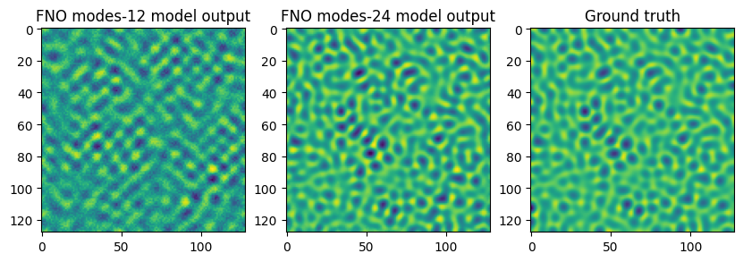

# A Numerical Study of Chaotic Dynamics of K-S Equation with FNOs
This repository contains code for the paper: https://arxiv.org/abs/2410.12280

Solving non-linear partial differential equations which exhibit chaotic dynamics is an important problem with a wide-range of applications such as predicting weather extremes and financial market risk. Since, accurately simulating chaotic systems with traditional methods can be computationally expensive, Fourier neural operators (FNOs) offer a potentially efficient alternative for solving partial differential equations (PDEs). 

## Evolution of random initial state by K-S equation:
This paper investigates the ability of FNOs to simulate the chaotic dynamics of a two-dimensional Kuramoto-Sivashinsky (K-S) equation: 
```math
    \partial_t u = -\frac12 |\nabla u|^2 - \nabla^2 u - \nabla^4 u .
```
Here is an example of evolution of a random intial state by the above equation for 10 secs.


## Comparison of FNO model output with different Fourier mode cutoffs versus ground truth
This study explores how well FNOs capture the chaotic behavior of the K-S equation, focusing on the effect of the Fourier mode cutoff (number of frequencies considered). The K-S equation is solved using a finite difference method (FDM) to generate training data. Two FNO models are trained with different Fourier mode cutoffs (12 and 24). Below we show a comparison of final state output of FNO model with Fourier mode cutoffs at 12 and 24 versus ground truth (i.e. reference test data obtained using FDM).



## Spectral analysis of FNO model output
Furthermore, the performance of FNOs is compared to the ground truth (original data) using spectral analysis techniques. We compare the outputs using metrics such as the 2d power spectrum and the radial power spectrum. In addition we propose the normalised error power spectrum which measures the percentage error in the FNO model outputs.

### 2d log power spectrum of output


### Radial power spectrum of prediction error

 | 

### Normalised error power spectrum


## Conclusion
We find that FNOs can capture the chaotic dynamics of the K-S equation, but a higher Fourier mode cutoff (24) performs better. Analysis using 2D power spectrum and radial power spectrum shows that the FNO with a higher cutoff captures more spectral features of the ground truth. Furthermore, a newly proposed "normalized error power spectrum" metric reveals that the percentage error in the FNO output decreases with a higher Fourier mode cutoff. The training losses suggest that even the better performing FNO model could benefit from more training data.

Therefore, FNOs are a promising approach for simulating chaotic systems, but sufficient Fourier modes are crucial for capturing the complexity. However, higher-order statistical properties of chaos such as the Lyapunov exponent need to be investigated to determine FNOs' ability to capture chaotic dynamics.
